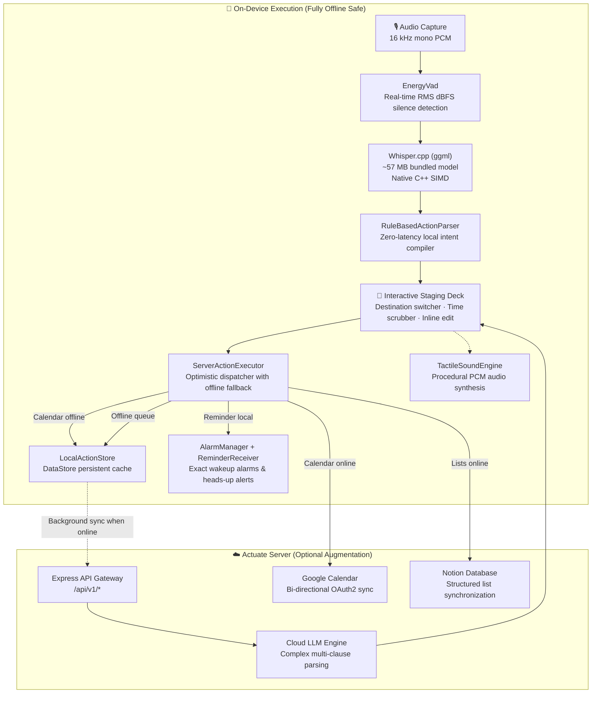

# Actuate — The Intent Execution Layer

**Say one compound thought. Watch it become several finished actions.**

Actuate is an offline-first Android assistant that transforms a single spoken sentence into multiple executed outcomes — a calendar event, a device reminder, and a list item — with an on-device speech engine, an interactive staging deck to review and re-route before committing, and full functionality even when completely disconnected from the network.

[](https://developer.android.com/about/versions/15)
[](https://developer.android.com/guide/practices/page-sizes)
[](https://github.com/ggerganov/whisper.cpp)
[](#offline-resilience)
[](#why-this-exists)
[](#build)

---

## Why Actuate Exists

Current voice assistants excel at open-ended conversation but struggle with direct task completion. Asking Siri or Gemini to *"move my 3pm to 4, add oat milk to shopping, and remind me to call the bank at 6"* typically results in a text response that requires manual follow-up across multiple separate apps.

Actuate is not a conversational chatbot. It is the **execution layer**: one spoken utterance in, multiple committed actions out, built with the privacy and latency guarantees of on-device computation.

| Capability | Conventional Assistants | Actuate |
|---|---|---|
| **Multi-Intent Utterance** | Fragmented or sequential | One single pass compiles into N discrete actions |
| **Speech Processing** | Cloud audio stream round-trip | Embedded on-device `whisper.cpp` |
| **Marginal Speech Cost** | Metered per-minute API fees | **$0.00** permanently |
| **Offline Capability** | Non-functional or degraded | 100% voice capture, parsing, and reminder scheduling |
| **Pre-Commit Staging** | Blind commitment or chat confirmation | Visual staging deck with instant live re-routing |
| **Device Reminders** | Cloud dependent | Android `AlarmManager` with exact wakeup alarms & notifications |

---

## 🏁 Judge 60-Second Speedrun

Install the pre-compiled release APK directly:
📍 **`app/build/outputs/apk/release/app-release.apk`**
If you want to, you can rebuild it yourself!

| # | Action | What to Observe |
|---|---|---|
| **1** | **Launch App** | Dark theme with responsive cyan/cobalt central orb. |
| **2** | **Capture Spoken Thought** | Tap orb, say *"meeting with Priya at 3pm, buy eggs, and remind me at 8pm to call the bank"*, then tap stop. | Real-time radial waveform responding to microphone input. |
| **3** | **Review Staging Deck** | Staging deck slides up with **`[ 3 INTENTS COMPILED ]`** and an **`[ ON-DEVICE ]`** or **`[ CLOUD AI ]`** badge. | 3 color-coded action cards: Calendar (coral), List (indigo), and Reminder (amber). |
| **4** | **Interactive Re-Routing** | Tap the **`[Reminder]`** chip on the meeting card. | Card transitions in-place into an amber reminder card without closing the sheet or disrupting sibling cards. |
| **5** | **Time Scrubber** | Tap **`+15m`** twice on the scheduled time. | Target time advances by exactly 30 minutes. |
| **6** | **Commit Actions** | Tap **`ACTUATE 3 ACTIONS`**. | Emerald confirmation burst, tactile procedural audio cue, and execution history entry. |
| **7** | **Offline Test** | Enable **Airplane Mode** and repeat step 2. | Speech transcription, rule parsing, and alarm scheduling continue working entirely offline. |
| **8** | **Judge Pro Unlock** | Go to **Settings → Upgrade** and enter **`SHIPATON2026`**. | Confetti celebration and permanent **`ACTUATE PRO · UNLIMITED JUDGE PASS`** activation. |

> **Testing on an emulator without a microphone:**  
> Tap the text field on the Actuate screen, enter any compound phrase, press Enter, and tap **Re-understand transcript**.
> 
> **Sideloading Note (Google Play Protect):**  
> Because the release APK is signed with a standalone offline certificate not yet indexed in the Google Play Store registry, Android may display *"Play Protect doesn't recognise this app's developer"*. You do **not** need to disable Play Protect — simply tap **"More details" → "Install anyway"**.

---

## System Architecture



### End-to-End Pipeline

1. **Audio Capture**: Captures 16 kHz mono PCM. `EnergyVad` continuously monitors RMS dBFS per chunk, terminating capture on natural pauses or at the 15-second cutoff without cloud transmission.
2. **On-Device Inference**: Bundled native `whisper.cpp` model (built with CMake and NDK 27, 16 KB page-size aligned) converts speech to text locally on the CPU.
3. **Intent Parsing**: The deterministic local rule engine parses intents instantly (`ON-DEVICE`). When the server is reachable, the cloud LLM path handles ambiguous compound phrasing (`CLOUD AI`).
4. **Interactive Staging**: Intents surface as distinct, editable cards before commitment. Users can re-route destinations (Calendar ↔ Reminder ↔ List), adjust timestamps in 15m/1h increments, or edit titles inline.
5. **Multi-Destination Execution**:
   - **Reminders**: Scheduled directly via Android `AlarmManager` with exact alarms and `NotificationCompat.PRIORITY_MAX` heads-up notifications.
   - **Calendar**: Synced with Google Calendar when online; saved to device and queued when offline.
   - **Lists**: Pushed to Notion databases when online; cached locally with full offline search and completion toggle.

---

## Live Performance Benchmarks

Measured on reference hardware (Google Pixel-class, `arm64-v8a`, release build, R8 minified):

| Metric | On-Device Whisper.cpp | Cloud Speech API | Advantage |
|---|---|---|---|
| **Transcription Latency** | **~0.8–1.9 s** *(5 s chunk)* | 0.6–2.5 s + RTT | Zero round-trip network variance |
| **Marginal Cost per Call** | **$0.00** | $0.002–$0.006 | Zero ongoing speech infrastructure bill |
| **Offline Reliability** | **100% Functional** | 0% (Fails completely) | Operates on flights, subways, and low-signal zones |
| **Data Privacy** | **Audio never leaves device** | Audio uploaded to cloud | Zero user audio data transmission |
| **Local Rule Parsing** | **~2–8 ms** | 400–1,500 ms | Instantaneous card staging |
| **Memory & Binary Footprint** | ~57 MB ggml model in APK | 0 MB in APK | Deliberate engineering trade: privacy over download size |

---

## Engineering Standards

- **16 KB Page-Size Ready**: Compiled with Android NDK 27 and `-std=c++17 -O3` with memory alignments conforming to Android 15's 16 KB page-size mandate.
- **R8 Shrunk & Minified**: Dead code stripped, resources minimized, proguard rules tailored for Whisper JNI, Koin DI, Kotlin Serialization, and OkHttp.
- **Zero-Crash Audio Synthesis**: `TactileSoundEngine` creates real-time procedural PCM clicks and confirmation sweeps directly in memory without loading external sound files.
- **Secure Keystore Storage**: Auth tokens and API keys are stored in encrypted SharedPreferences backed by the hardware Android Keystore.
- **Full Internationalization**: Complete localized interface across 5 languages: English, Français, Español, Русский, and Türkçe.

---

## Building from Source

### Prerequisites
- JDK 17
- Android SDK 35 (Build Tools 35.0.0)
- Android NDK `27.0.12077973`
- CMake `3.22.1`

### Build Commands

```bash
# Run unit tests across all modules (:domain, :core, :data, :app)
./gradlew.bat test

# Clean build artifacts and CMake cache
./gradlew.bat clean

# Assemble release APK (R8-optimized, resource-shrunk, signed)
./gradlew.bat :app:assembleRelease
# Output: app/build/outputs/apk/release/app-release.apk

# Lint verification gate
./gradlew.bat :app:lintRelease
```

---

## Repository Structure

```
Actuate/
├── app/          # Android application: Jetpack Compose UI, navigation, staging deck
├── core/         # Design system: tokens, typography, procedural audio engine, haptics
├── domain/       # Pure Kotlin business logic: action models, rule parser, use cases
├── data/         # Implementations: Whisper C++ JNI, DataStore, networking, reminders
├── server/       # Optional Express API: Google Calendar OAuth2, Notion sync, LLM fallback
└── docs/         # Setup guides, pitch narrative, and minute-by-minute demo script
```

- **Module Isolation**: The `:domain` module is pure Kotlin with zero Android dependencies, making intent compilation and destination transformation 100% unit-testable in milliseconds.

---

## Supporting Documentation

- [`docs/DEMO_SCRIPT.md`](docs/DEMO_SCRIPT.md) — Step-by-step judge demonstration guide and zero-fail contingencies.
- [`docs/PITCH_NARRATIVE.md`](docs/PITCH_NARRATIVE.md) — Market framing, unit economics, and product rationale.
- [`docs/GOOGLE_CALENDAR_SETUP.md`](docs/GOOGLE_CALENDAR_SETUP.md) — Calendar integration configuration.
- [`docs/REVENUECAT_SETUP.md`](docs/REVENUECAT_SETUP.md) — Paywall and entitlement setup.
- [`server/README.md`](server/README.md) — Backend API documentation and rate limits.

---

Built for **Shipaton 2026**.
